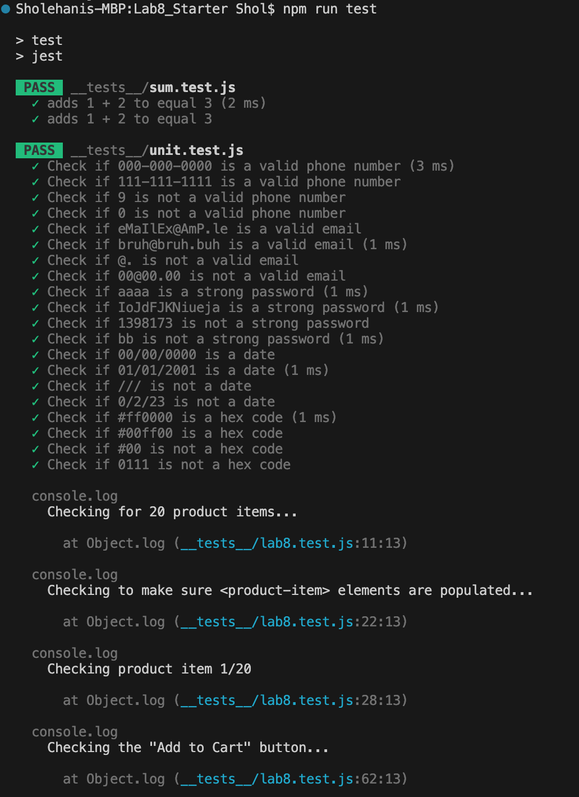

# Lab 8 - Starter

## Names: Sholehani Hafezi

---
## Check Your Understanding
1. 1: To automatically test with other components within repository and does not need to set up dependencies.
2. no: End-to-end focuses on testing the entire project (all user actions from start to finish) rather than a single function.
3. no: Testing user message involves many components, where their interactions can not be tested.
4. yes: The max message length is a single component being tested at a small scale of only 80 characters.

## Screenshots:

